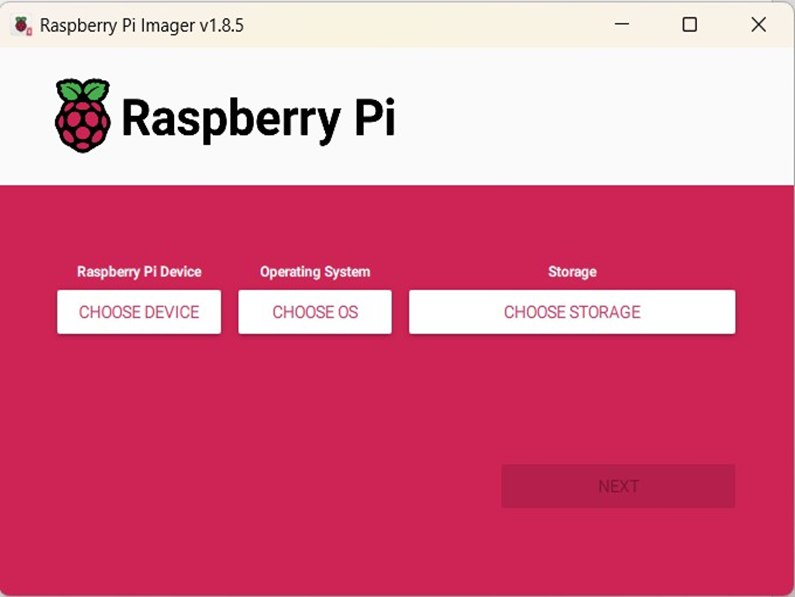
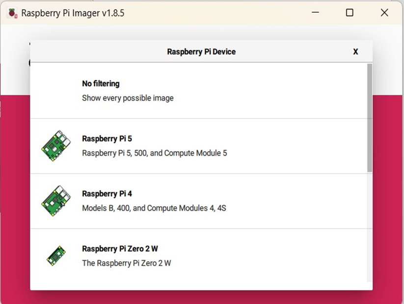
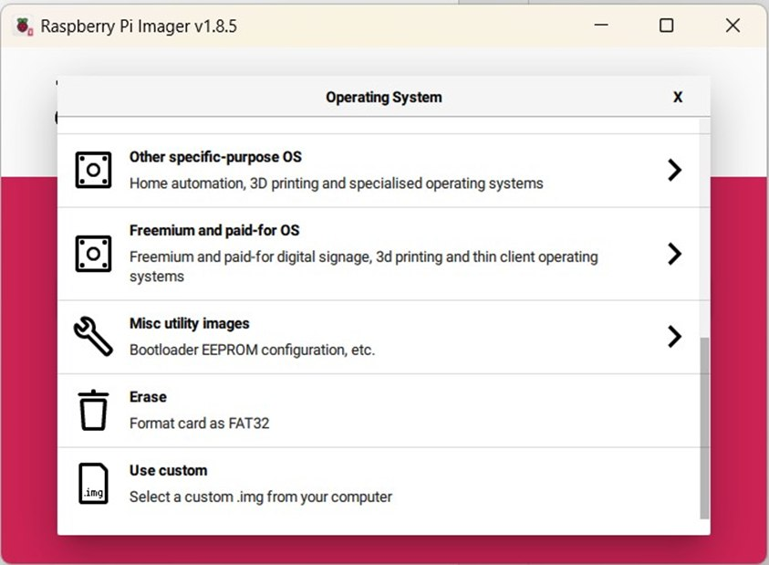
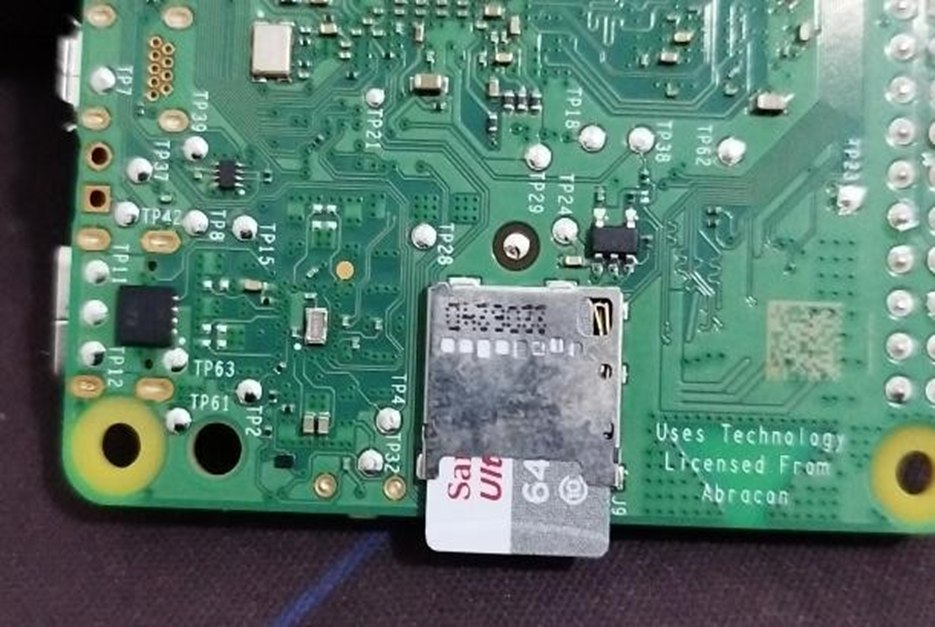

# Dokumentasi Menginstall Ubuntu dan ROS 2 di Raspberry Pi 5


---

## 📖 Description
Dokumentasi ini menjelaskan proses instalasi sistem operasi Ubuntu 24.04 (Noble Numbat) dan ROS 2 Jazzy pada Raspberry Pi 5. Panduan ini dirancang untuk kebutuhan pengembangan sistem robotika berbasis embedded system, mulai dari persiapan perangkat hingga verifikasi instalasi ROS 2.

---

## ⚙️ Requirements

### Hardware
- Raspberry Pi 5 (RAM 8 GB)
- SD Card minimal 64 GB
- Laptop/PC
- Keyboard & Mouse

### Software
- Raspberry Pi Imager  
  https://www.raspberrypi.com/software/

- Ubuntu 24.04 (Noble Numbat) Image (ARM64)  
  https://ubuntu.com/download/raspberry-pi

---

## 💿 Installation

### A. Instalasi Ubuntu 24.04

1. Masukkan SD Card ke laptop (pastikan sudah diformat).

2. Buka aplikasi **Raspberry Pi Imager**  
   <p align="center">
     
   </p>

3. Pilih device:
   - Raspberry Pi 5  
   <p align="center">
     
   </p>

4. Pilih Operating System:
   - Klik **Use custom**
   - Pilih file image Ubuntu yang telah didownload  
   <p align="center">
     
   </p>

5. Pilih Storage:
   - Pilih SD Card yang digunakan  
   <p align="center">
     
   </p>

6. Klik **Next** dan tunggu proses instalasi selesai.

7. Setelah selesai:
   - Keluarkan SD Card dari laptop
   - Pasang ke Raspberry Pi  
   <p align="center">
     
   </p>

---

### B. Instalasi ROS 2 Jazzy

#### 1. Setup Locale & Repository
```bash
sudo apt update && sudo apt install locales
sudo locale-gen en_US en_US.UTF-8
export LANG=en_US.UTF-8

sudo apt install software-properties-common
sudo add-apt-repository universe
```

#### 2. Tambahkan Repository ROS 2
```bash
sudo apt update && sudo apt install curl -y
sudo curl -sSL https://raw.githubusercontent.com/ros/rosdistro/master/ros.key \
  -o /usr/share/keyrings/ros-archive-keyring.gpg

echo "deb [arch=$(dpkg --print-architecture) signed-by=/usr/share/keyrings/ros-archive-keyring.gpg] \
http://packages.ros.org/ros2/ubuntu $(. /etc/os-release && echo $UBUNTU_CODENAME) main" | \
sudo tee /etc/apt/sources.list.d/ros2.list > /dev/null
```

#### 3. Install ROS 2 Jazzy
```Bash
sudo apt update
sudo apt install ros-jazzy-desktop
```

#### 4. Setup Environment
```Bash
source /opt/ros/jazzy/setup.bash
```
Agar otomatis setiap membuka terminal:
```Bash
echo "source /opt/ros/jazzy/setup.bash" >> ~/.bashrc
```

#### 5. Testing ROS 2

Terminal 1:
```Bash
source /opt/ros/jazzy/setup.bash
ros2 run demo_nodes_cpp talker
```
Terminal 2:
```Bash
source /opt/ros/jazzy/setup.bash
ros2 run demo_nodes_py listener
```
Jika berhasil, node akan saling berkomunikasi (publisher & subscriber).

### 🙌 Credits
ROS 2 Documentation
https://docs.ros.org/en/jazzy/index.html
Ubuntu Documentation
Raspberry Pi Foundation
